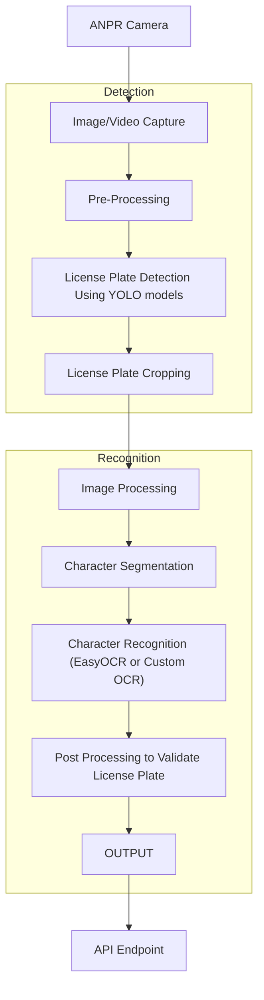

# License Plate Recognition Pipeline

This document outlines the workflow for Automated Number Plate Recognition (ANPR) using YOLO for detection and EasyOCR (or a custom OCR model) for recognition.

## Workflow

